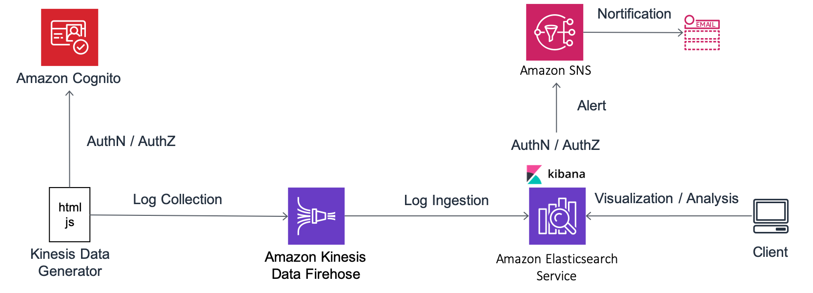

## Amazon Elasticsearch Service Intro Workshop

This workshop is an introduction for Amazon Elasticsearch Service (Amazon ES). Amaon ES is a managed service that provides an open source full-text search engine Elasticsearch in a secure and scalable manner. Amazon ES is mainly used by many customers in two ways below:

- Real-time dashboards and log analysis for stream data
- Full-text search mainly for text data

In this workshop, you will understand how to use Amazon ES by actually building a real-time dashboard and performing a full-text search using Amazon ES and related AWS services. The goals of this workshop is to provide you a basic knowledge of Amazon EX for future use.

This workshop also supports [Japanese version](jp/README.md) for Japanese users.

## Preparation

- A PC with a network accessible to AWS services (Windows, Mac OS, Linux, etc.)
- AWS account prepared in advance
- Browser (Firefox or Chrome recommended)

## Workshop Overview

In this workshop, you will build the following architecture.

This workshop consists of the following four Labs. You should follow the link below and proceed in order from Lab 1. Please remember to [clean up](en/cleanup/README.md) before finishing the workshop. If you do not clean up, you will be charged continuously.

- [Lab 1](en/lab1/README.md): Setting Up Your Environment
- [Lab 2](en/lab2/README.md): Visualization and Analytics in Kibana
- [Lab 3](en/lab3/README.md): Operational Management for Amazon ES
- [Lab 4](en/lab4/README.md): Full-text search with English documents

## Precautions throughout the hands-on

- This hands-on is basically explained in the premise of “Northern Virginia Region”. If you reach the upper limit of resources in that region, you can also create your environment in other region, such as Oregon region. In such case, please replace all references to "Northern Virginia (us-east-1)" in each hands-on material with "Oregon (us-west-2)"
- If more than one person try this hands-on at the same time with the same AWS account, please be careful not to duplicate resource names, etc.
- You can freely customize the name of any item that is described as "optional" in each step. However, we recommend that you proceed with the name as it is, so that you don't get confused by the name you specified during hands-on.
- The section where "Explanation" is written in the steps is a detailed explanation of the contents handled in the hands-on. Even if you skip it, you would not have any problem to go through the hands-on process. However, this section contains a description of the technical background and the contents of the hands-on, so you could gain deepler knowledge.

## License

This library is licensed under the MIT-0 License. See the LICENSE file.

