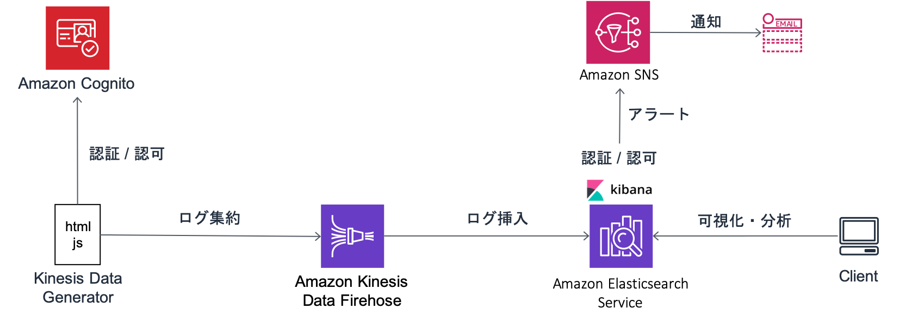
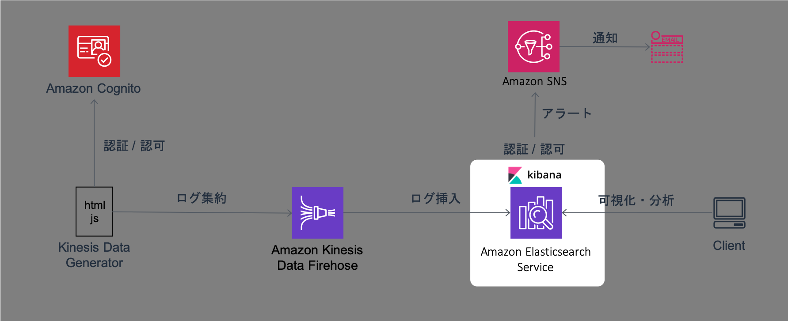
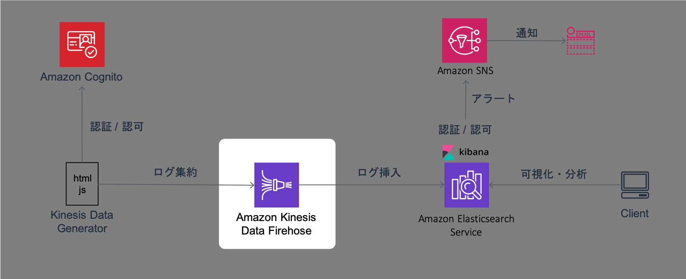
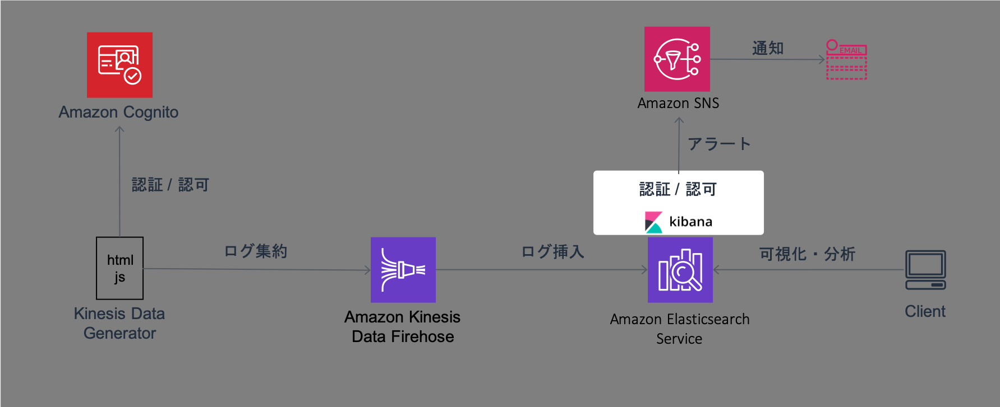
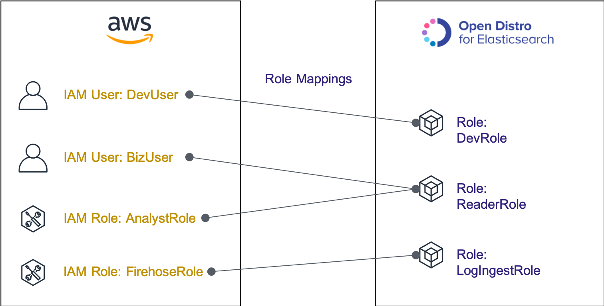
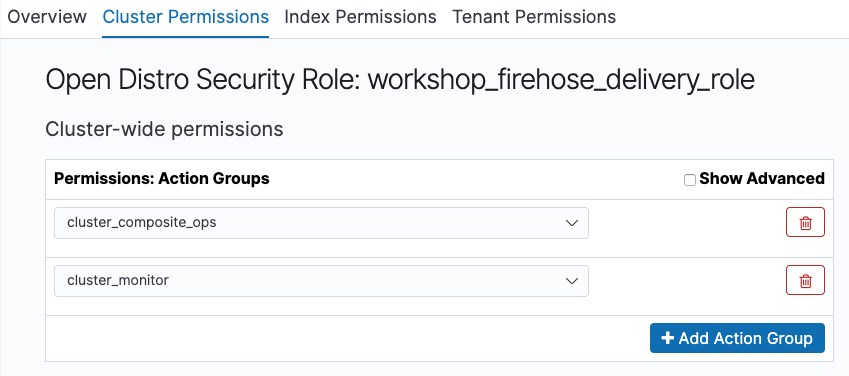
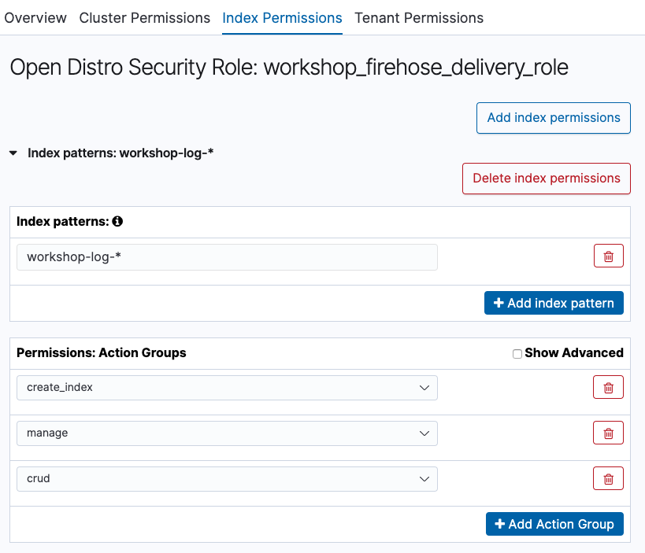
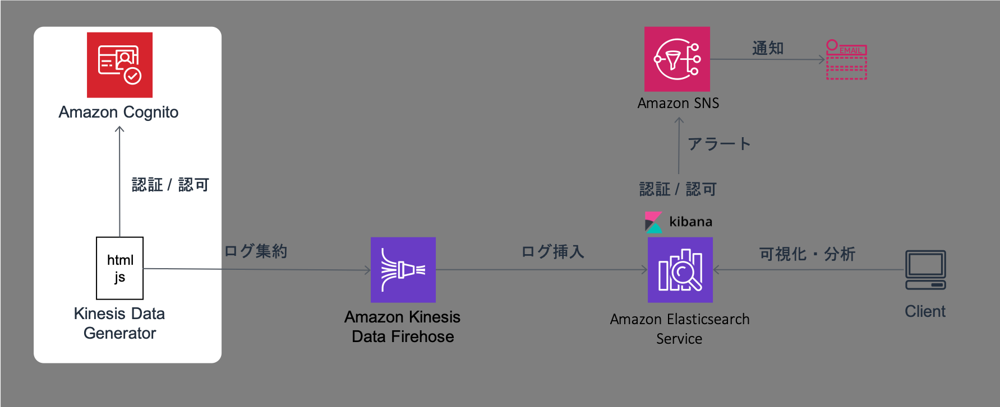
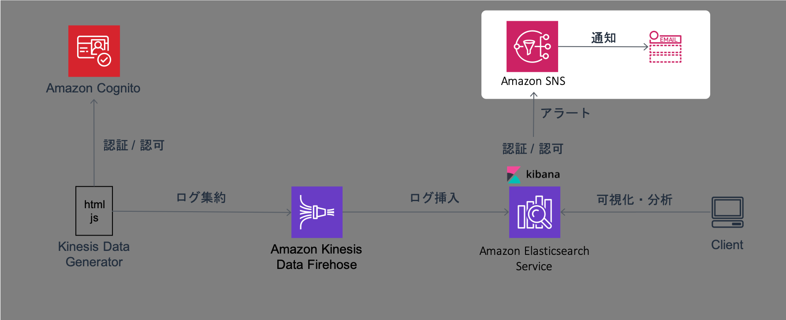

# Lab 1: 環境のセットアップ

この Lab では，他の Lab で必要となる環境のセットアップを行います．この章で構築するシステムの全体像は以下の通りです．



このシステムでは，Kinesis Data Generator という JavaScript ベースのツールを用いて分析用のログを生成します．このツールでは，ログを送信するための認証/認可を，Amazon Cognito というサービスを用いて行います．その上で Generator から所定フォーマットのログを，Amazon Kinesis Firehose（以下 Firehose）というログ集約サービスに送ります．Firehose に送られたデータは，指定した間隔でデータをまとめて Amazon Elasticsearch Service（以下 Amazon ES）に書き込まれます．Amazon ES には Kibana と呼ばれる，ブラウザベースの可視化・分析ソフトウェアが同梱されています．この Kibana を用いて，ブラウザから実際にログの可視化・集計処理を行っていきます．また Amazon ES でデータの監視を行い，問題が起きた場合には，Amazon Simple Notification Service（以下 Amazon SNS）という通知サービスに対してアラートを飛ばします．

## Section 1: Amazon ES のドメイン作成

まずは，Amazon ES のドメインを作成します．Amazon ES では，Elasticsearch クラスターのことをドメインと呼びます．ドメイン作成の処理を行うと，裏で新しく仮想マシンが立ち上がり，Elasticsearch クラスターのセットアップが始まります．



### Amazon ES のドメイン作成

1. AWS マネジメントコンソールにログインします．ログイン後，画面右上のヘッダー部のリージョン選択にて， **[東京]** となっていることを確認します．もし **[東京]** となっていない場合は，リージョン名をクリックして，**[東京]** に変更してください
2. AWS マネジメントコンソールの画面左上にある [サービス] を押してサービス一覧を表示させ，**[Elasticsearch Service]** を選択してください（画面上部の検索窓に **"elasticsearch"** などと打ち込むことで，サービスを絞り込むことが可能です）．Elasticsearch の画面を開いたら **[Create a new domain]** ボタンを押して，ドメイン作成画面に進みます
3. **"Step 1: デプロイタイプの選択"** において，**"デプロイタイプの選択"** で **[開発およびテスト]** を選択します．バージョンは変更せず，そのまま **[次へ]** を押してください
4. **"Step 2: ドメインの設定"** で，**"Elasticsearch ドメイン名"** に **"workshop-esdomain"** と入力します．それ以外の箇所は変更せずに **[次へ]** を押してください
5. **"Step 3: アクセスとセキュリティの設定"** で，**"ネットワーク構成"** を **[パブリックアクセス]** に設定します．続いて **"細かいアクセスコントロール"** で，**[マスターユーザーの作成]** を選択してください．ここで設定マスターユーザーのアカウントは，Amazon ES 上の可視化ツール Kibana にログインするために使われます．インストラクションに従って任意の **マスターユーザー名** および **マスターパスワード** を入力してください．マスターユーザー名は 1-16 文字の間で設定する必要があります．またマスターパスワードは 8 文字以上，かつ大文字，小文字，数字，および特殊記号をそれぞれ一つずつ含む形で入力してください．ここで設定したユーザー名，パスワードは Section 3 で使用します
6. 次にアクセスポリシーの項目を設定します．[こちら](https://www.cman.jp/network/support/go_access.cgi)にアクセスして，自身の IP を確認してください．続いて **"ドメインアクセスポリシー"** で **[カスタムアクセスポリシー]** を選択し，その下の項目で **[IPv4 アドレス]** を選びます．その右の空欄に，先ほど確認した自身の IP をそのまま入力し，その右を **[許可]** に設定します．ここまで設定したら，画面一番下の **[次へ]** を押してください
   
7. **"Step 4: 確認"** で，これまでの設定内容を眺めて，特に問題がなければ画面右下の **[確認]** を押してドメインを作成してください．ドメイン作成には 15 分程度かかりますので，その間に次の Firehose ストリーム作成に進みます

### 解説: Amazon ES について

**TODO: もう少し説明充実させる**

今回のハンズオンでは，あくまでお試しということで 1 台だけで Elasticsearch を立てています．ですが本来，Elasticsearch は複数台のマシンでクラスターを組むことで，大規模データを扱ったり，高い可用性を得たりできるものです．そこで本番運用する際の Amazon ES では，クラスターの管理を行うマスターノードを複数台，また実際のデータを格納するデータノードも複数台用意します．

マスターノードはデータノードと同居させることもできますが，大規模なクラスターや負荷の高いワークロードの場合は，クラスター管理だけを行う専用のマスターノードを用意するのが推奨です．またマスターノードについては，3 台以上の奇数で設定することが推奨されています．Amazon ES では 3 または 5 台を選択することができます．なぜ偶数ではダメなのか，についての詳細については[公式ドキュメント](https://docs.aws.amazon.com/ja_jp/elasticsearch-service/latest/developerguide/es-managedomains-dedicatedmasternodes.html) をご覧ください．

## Section 2: Firehose のストリーム作成

続いて Amazon ES にログを挿入するために使用する，Firehose ストリームを作成します．



### Firehose のストリーム作成

1. 先ほどと同様，画面右上のヘッダー部のリージョン選択にて， **[東京]** となっていることを確認します．もし **[東京]** となっていない場合は，リージョン名をクリックして，**[東京]** に変更してください．続いて AWS マネジメントコンソールの画面左上にある [サービス] から **[Kinesis]** のページを開いてください
2. 画面真ん中の **[今すぐ始める]** ボタンを押して，開始チュートリアルページに進みます．メニュー右上の **[配信ストリームの作成]** ボタンを押して，Firehose ストリームの作成ページを開いてください
3. **"Step 1: Name and source"** では，**"Delivery stream name"** に **"workshop-firehose"** と入力します．他の設定は変更せずに **[Next]** を押してください
4. **"Step 2: Process records"** は特に何も変更せず，**[Next]** を押してください
5. **"Step 3: Choose a destination"** で，**"Destionation"** として **[Amazon Elasticsearch Service]** を選択します．次に **"Amazon Elasticsearch Service destination"** の **"Domain"** で，先ほど作成した **[workshop-esdomain]** を選択してください．これで，先ほどの Amazon ES に対して自動でログを挿入することができるようになります．Domain が Processing のステータスの場合は，選択可能になるまで待ってください
6. 次に **"Index"** で **"workshop-log"** と入力してください．Amazon ES の Index は，DB でいうところのテーブルに相当するものですが，この Firehose ストリームから送られたログは workshop-log という index に挿入されることになります．挿入時に Amazon ES 側に Index が存在しない場合には，自動で Index が作成されます
7. その下の **"S3 backup"** で，**"Back up S3 bucket"** の右側 **[Create new]** ボタンを押して，S3 バケットの作成画面に進みます．**"S3 bucket name"** に，**"workshop-firehose-backup-YYYYMMDD-YOURNAME"** と入力します（YYYYMMDD は 20200701 のように，今日の日付と置き換えてください．また YOURNAME は taroyamada のようにご自身の名前と置き換えてください．この場合バケット名は "workshop-firehose-backup-20200701-taroyamada" となります）．このバケットは， Firehose から Amazon ES に挿入する際にエラーになったレコードを，バックアップとして格納するためのものです
8. **"Step 4: Configure settings"** で，一番下の "Permission" において **[Cteate new or choose]** ボタンを押します．**"IAM ロール"** で **[新しい IAM ロールの作成]** を選択して，**"ロール名"** に **"workshop_firehose_delivery_role"** と入力して **[許可]** ボタンを押します．下の画面に戻ったら **[Next]** を押します
9. **"Step 5: Review"** で，これまでの設定内容を眺めて，特に問題がなければ画面右下の **[Create delivery stream]** を押してドメインを作成してください．ストリームの作成には数分程度かかります

### 解説

**TODO: IAM ロールについて軽く説明**

## Section 3: Amazon ES の権限設定

ここまで Amazon ES ドメインと，そこにログを挿入するための Firehose ストリームの作成を行いました．しかし，まだ適切な権限設定を行なっていないため，Firehose から Amazon ES にログを送ることはできません．ここでは Amazon ES 上のウェブインターフェースである Kibana を使って，Firehose にログを挿入するための権限を付与していきます．



### Amazon ES の権限モデル

Amazon ES では，オープンソースの Elasticsearch ディストリビューションである，Open Distro for Elasticsearch をベースとしています．Open Distro には独自の権限管理モデルがあり，Amazon ES でもこれを使用することができます．Open Distro の権限モデルは以下の通りで，Role と Role Mappings から構成されます．

**Role**: Elasticsearch のさまざまな権限を束ねた単位です．例えばクラスター自体を操作したり，データを追加・削除する権限が付与された  development role や，クラスター上の特定ログデータだけを読み取りできる reader role を設定することができます．Elasticsearch にはあらかじめいくつかのロールが定義されています

**Role Mappings**: 上で定義した Elasticsearch の Role と，AWS の IAM ユーザーや IAM ロールの紐付けのことを指します．これにより，特定の IAM ロールに対して，必要な Elasticsearch の操作を許可できるようになります

ここでは，Amazon ES にログを追加する権限を持った書き込み用ロールを新しく定義し，このロールを AWS 側の Firehose の IAM ロールに紐付けます．これらをまとめたものが以下の図になります．同じロールという言葉が AWS IAM と Open Distro とで使われており混乱しやすいですが，両者は全く別のものです．AWS IAM のロールは，AWS 上の権限管理を行うためのもので，Open Distro のロールは Elasticsearch クラスター上の権限管理ようです．これらを結びつけるのが Open Distro の Role Mappings の役割となります．



### Amazon ES ロールの作成

1. AWS マネジメントコンソールの画面左上にある [サービス] から **[Amazon ES]** のページを開いてください
2. Amazon ES のダッシュボード画面上で，先ほど作成したドメイン **[workshop-esdomain]** をクリックします．ドメインの詳細が表示されたら，**"Kibana"** の横にある URL をクリックしてください．Kibana のログイン画面が表示されますので，Section 1 で指定したマスターユーザーとマスターパスワードを入力してください
3. ログイン後の画面では，**[Explore on my own]** を選択します．続いて画面左側のマークをクリックして，セキュリティ設定のメニューを開きます
4. **"Permissions and Roles"** の下にある **[Roles]** をクリックして，ロール管理画面に進みます．Amazon ES にログを挿入する用のロールを作成するために，画面右側の + ボタンをクリックします
   
5. **"Role name"** に **"opendistro_firehose_role"** と入力します．続いて上側の **[Cluster Permissions]** タブを選択してクラスター権限設定のメニューを開いたら，**[+ Add Action Group]** ボタンを押します．プルダウンメニューから **[cluster_composite_ops]** を選択します．続いてもう一度 **[+ Add Action Group]** ボタンを押し，**[cluster_monitor]** を追加します．これらの権限は，クラスターの情報を読み取るためのもので，Open Distro 側であらかじめ定義されているものになります．詳細を知りたい方は[こちら](https://opendistro.github.io/for-elasticsearch-docs/docs/security-access-control/default-action-groups/#cluster-level)をご確認ください．これによって，下図のような状態になります
   
6. 次に上側の **[Index Permissions]** タブを選択し，**[Add index permissions]** ボタンを押します．**"Index patterns"** に，先ほど Firehose 側で指定した index 名である **"workshop-log"** を入力してください．続いてその下の **"Permissions: Actuion Groups"** で，この index に対して許可するアクションを設定します．**[+ Add Ation Group]** を押して，プルダウンメニューから **[create_index]** を選択します．同様に **[+ Add Ation Group]** を 2 回押して，**[manage]** と **[crud]** を追加します．最終的な状態は以下のようになります
   
7. 画面下側の，**[Save Role Definition]** ボタンを押して，ロールを作成してください

### Open Distro ロールと IAM ロールの紐付け

1. AWS マネジメントコンソールの画面左上にある [サービス] から **[Kinesis]** のページを開いてください．画面右上の **"Kinesis Firehose 配信ストリーム"** から，先ほど作成した **[workshop-firehose]** を選択します．ストリームの詳細画面で，**"IAM role"** に表示されている **[workshop_firehose_delivery_role]** のリンクをクリックしてください
2. IAM の管理画面で，**"ロール ARN"** の右にある **"arn:aws:iam::123456789012:role/workshop_firehose_delivery_role"** のような文字列をコピーします（この値は，各人で異なったものであるため，必ず画面上でコピーしてくだい）．これが Firehose の AWS リソースへのアクセス権限を管理する，IAM ロールと呼ばれるものです
3. 続いて Kibana の管理画面に戻ります．画面左側のマークをクリックして，セキュリティ設定のメニューを開いてください．**"Permissions and Roles"** の下にある **[Role Mappings]** をクリックして，ロール紐付け画面に進みます
4.  画面右側の + ボタンをクリックして，新しい紐付けの作成画面を開きます．画面上部の **"Role:"** 下のプルダウンメニューから，先ほど作成した **[opendistro_firehose_role]** を選択します．続いて **"Backend roles"** にある **[+ Add Backend Role]** ボタンを押して， 先ほどコピーしたロール ARN の文字列を貼り付けてください
5. 最後に **[Submit]** を押して，紐付けを完了します

## Section 4: Kinesis Data Generator のセットアップ

そして Kinesis Data Generator のセットアップを行います．Kinesis Data Generator は，Kinesis に流し込むログを生成するためのウェブアプリケーションで，AWS により開発・公開されています．このツールについて詳しく知りたい方は，[こちらの解説記事](https://aws.amazon.com/jp/blogs/news/test-your-streaming-data-solution-with-the-new-amazon-kinesis-data-generator/)を参照ください．



### CloudFormation による必要なリソースの作成

1. [こちら](https://console.aws.amazon.com/cloudformation/home?region=us-west-2#/stacks/new?stackName=Kinesis-Data-Generator-Cognito-User&templateURL=https://aws-kdg-tools.s3.us-west-2.amazonaws.com/cognito-setup.json)をクリックして，CloudFormation のスタック作成画面を立ち上げます．Kinesis Data Generator では，ログイン認証およびログ送信権限の認可に，Amazon Cognito というサービスを裏で利用します．この CloudFormation スタックを作成することで，必要な Cognito のリソースを作成してくれます．
2. **"ステップ 1: テンプレートの指定"** で，すでにテンプレートソースが置かれている Amazon S3 URL が入力済みであることを確認してください．このCloudFormation のスタック作成はオレゴンリージョンでしか実施できません．そのため画面右上のリージョン選択画面が **[オレゴン]** になっていますが，これを変更せずそのまま **[次へ]** を押します
3. **"ステップ 2: スタックの詳細を指定"** で，**"Cognito User for Kinesis Data Generator"** の **"Username"** と **"Password"** に，それぞれ適当な値を入力してください．ここで指定したユーザー名とパスワードは，すぐ後で Kinesis Data Gnerator にログインする際に使用します．入力したら **[次へ]** をクリックします
4. **"ステップ 3: スタックオプションの設定"** では，何も変更せずに **[次へ]** を押します
5. **"ステップ 4: レビュー"** で，画面一番下の **"AWS CloudFormation によって IAM リソースが作成される場合があることを承認します。"** のチェックボックスを選択してから，**[スタックの作成]** ボタンを押してスタックの作成を開始してください
6. スタックのステータスが CREATE_COMPLETE になるまで，数分程度待ちます

### Kinesis Data Generator によるログ送信

1. 作成した CloudFormation スタックの **[出力]** タブを選択します．表示される **"KinesisDataGeneratorUrl"** の URL をクリックすることで，Kinesis Data Generator の設定画面を開くことができます

2. 前の手順で入力したユーザー名とパスワードを，画面右上の **"Username"** と **"Password"** に入れてログインしてください

3. ここから，実際に送信するログの設定を行なっていきます．**"Region"** で **[ap-northeast-1]**（東京リージョンのこと）を選択，また **Stream/delivery stream** で先ほど作成した **[workshop-firehose]** を選んでください

4. 続いて **Records per second**（1 秒間に生成されるログのレコード数）に **"5"** と入力します．つまり毎秒 5 レコード，1 分間で 300 件が生成されて，Firehose に送られることになります

5. その下の **"Record template"** で，**"Templete 1"** の下に書かれているサンプルフォーマットを消して，以下の内容をコピーして貼り付けてください．ここでは，IoT センサーから送信されるログを想定したフォーマットを指定します．乱数等を用いて，ダミーのログデータを自動生成してくれます

   ```
   {
       "sensorId": {{random.number(50)}},
       "currentTemperature": {{random.number(
           {
               "min":10,
               "max":150
           }
       )}},
       "ipaddress": "{{internet.ip}}",
       "status": "{{random.weightedArrayElement({
           "weights": [0.90,0.02,0.08],
           "data": ["OK","FAIL","WARN"]
       })}}",
       "timestamp": "{{date.now("YYYY/MM/DD HH:mm:ss")}}"
   }
   ```

6. 画面下側の [Test template] を押すと，実際に送信されるログのサンプルを確認することができます．以下のようなレコードが 5 つ生成されるのが確認できるかと思います

   ```
   {    "sensorId": 42,    "currentTemperature": 38,    "ipaddress": "29.233.125.31",    "status": "OK",    "timestamp": "2020/03/03 12:49:12"}
   ```

7. 問題なければ，最後に **[Send data]** ボタンを押して，ログの送信を始めてください．ポップアップで表示される [Stop Sending Data to Kinesis を押すか，ブラウザタブを閉じるまで，Firehose に対してデータが送信され続けます

## Section 5: Amazon SNS のトピック作成

最後に，Amazon SNS のトピックと，通知する先のメール配信設定を作成します．



### Amazon SNS のトピック作成

SNS のトピックは，通知を管理する単位です．Lab 3 で Amazon ES からこのトピックに対してアラートの通知を送ります．

1. AWS マネジメントコンソールの画面左上にある **[サービス]** から **[SNS]** のページを開いてください．画面左側のメニューアイコンを押して，トピックをクリックします．右側の **[トピックの作成]** ボタンを押して，トピック作成画面に進みます
2. **"名前"** に **"amazon_es_alert"**，**"表示名"** も **"amazon_es_alert"** と入れて **[トピックの作成]** ボタンを押します
3. トピック一覧に，今作成したトピックが表示されているのをみつけたら，右側の ARN（`arn:aws:sns:ap-northeast-1:123456789012:amazon_es_alert` のような文字列です）をコピーしておいてください．後ほど IAM ロールの作成で使用します

### サブスクリプションの作成

次にサブスクリプションを作成します．これはトピックを購読して，通知を受け取る先の設定を指します．ここでは，上で作成したトピックを購読する email を登録します．

1. 左側メニューの **[サブスクリプション]** を押して，右側の **[サブスクリプションの作成]** ボタンを押します．トピック ARN から，先ほど作成したトピックを選択してください．プロトコルとして **[E メール]** を選択し，エンドポイントに，通知を受け取れるご自身のメールアドレスを入力してください
2. 上記の設定が済んだら **[サブスクリプションの作成]** を押して作成を完了してください 
3. 数分内に，入力したメールアドレス宛に Amazon SNS から "AWS Notification - Subscription Confirmation" というタイトルのメールが来ますので，メール本文にある **[Confirm subscription]** リンクをクリックして，設定を完了します

### IAM ロールの作成

最後に，Amazon ES から SNS トピックに通知を送るための，IAM ロールを作成します．

1. マネジメントコンソールで、IAM のコンソールを開き、**[ロール]**，**[ロールの作成]** の順に選択します．作成ページで， **[AWS サービス]** を押し，続いてその下の **"一般的なユースケース"** にある **[EC2]** をクリックしたら，**[次のステップ: アクセス権限]** ボタンを押します

2. **[ポリシーの作成]** ボタンをクリックすると新しいブラウザタブが開きます．そこで **[JSON]** タブを選択して，以下の内容で上書きしてください．なお，下のコードのうち "SNS_TOPIC_ARN" となっている部分を，先ほどコピーした SNS トピックの ARN と置き換えてください．終わったら画面下部の **[ポリシーの確認]** ボタンを押します

   ```json
   {
     "Version": "2012-10-17",
     "Statement": [{
       "Effect": "Allow",
       "Action": "sns:Publish",
       "Resource": "SNS_TOPIC_ARN"
     }]
   }
   ```

3. **"名前"** に **"amazones_sns_alert_policy"** と入力したら，**[ポリシーの作成]** を押します．作成が終わったら，このブラウザタブを閉じて，もとのロール作成画面に戻ってください

4. ロール作成画面で，右上のリロードボタンを押してから，フィルタ内に **"amazones_sns_alert_policy"** と入力し，ポリシーを絞り込みます．先ほど作成したポリシーにチェックをつけたら，**[次のステップ: タグ]** を押します

5. タグの設定画面では何もせずに，**[次のステップ: 確認]** ボタンを押します

6. "ロール名" に **"amazones_sns_alert_role"** と入力したら，**[ロールの作成]** ボタンを押して，ロールをの作成が完了です

7. 元のロール一覧画面に戻ったら，検索窓に **"amazones_sns_alert_role"** と入力して，作成したロールを選択してください．ロールの詳細画面が表示されたら，**[信頼関係]** タブをクリックして，**[信頼関係の編集]** ボタンを押します．編集画面に入ったら，既存の中身を次の内容に置き換えてください．これは Amazon ES のドメイン（es.amazon.com）から，このロールを利用可能にするための設定です

   ```json
   {
     "Version": "2012-10-17",
     "Statement": [
       {
         "Effect": "Allow",
         "Principal": {
           "Service": "es.amazonaws.com"
         },
         "Action": "sts:AssumeRole"
       }
     ]
   }
   ```

8. 画面下部の **[ 信頼ポリシーの更新]** ボタンを押して元の画面に戻ります

以上で，Amazon SNS の設定が終わりました

## まとめ

Lab 1 では，以降の Lab で必要な環境のセットアップを行いました．これにより，Kinesis Data Generator で生成したデータを Firehose で集約し，Amazon ES に挿入，さらに Kibana から Amazon ES のデータを確認できるようになりました．続いて [Lab 2](../lab2/README.md) に進んでください．