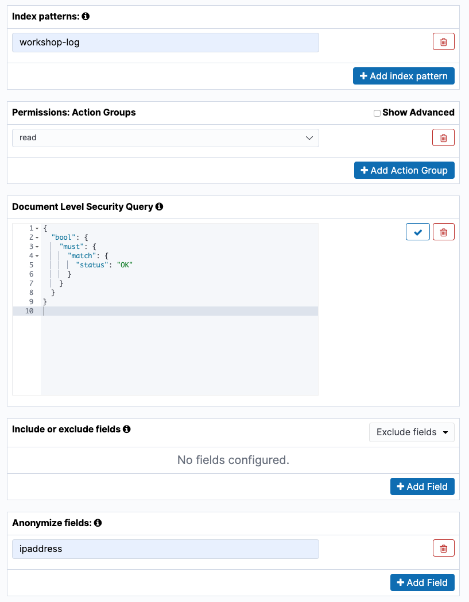
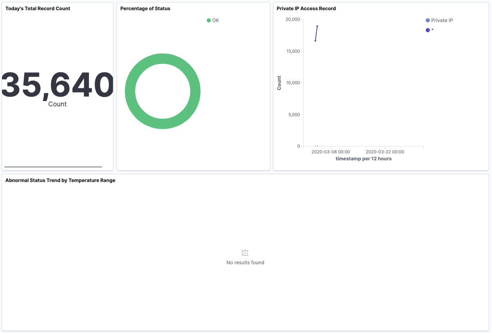
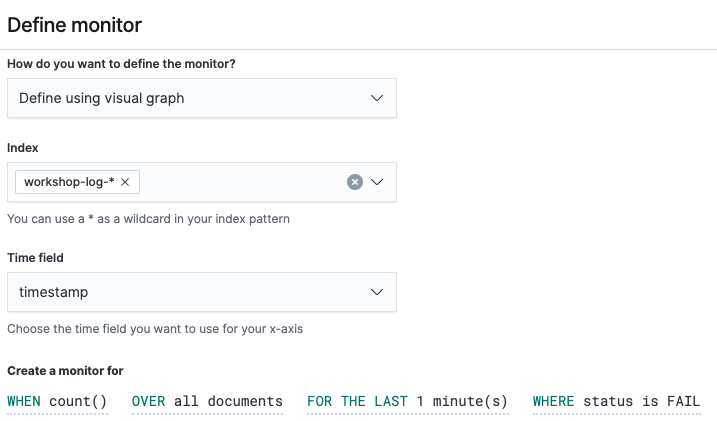

# Lab 3: Amazon ES の運用管理

前の Lab ではビジュアルの作成や分析といった，Kibana の基本的な使い方を実際に試してきました．この Lab では，権限管理やアラートといった，運用管理に関する事柄について，実際に手を動かして試していただきます．

## Section 1: Amazon ES の権限管理

Lab 1 で Amazon ES をセットアップして，Kibana にログインする際に，ユーザー名とパスワードによる認証がありました．そこではマスターユーザーのアカウントを使ってログインしました．しかし多くのユーザーが Kibana を使って分析を行う際に，同じマスターアカウントを使い回すわけにはいきません．ユーザーごとに個別のアカウントを作成し，さらにユーザーの役割に合わせた限られた権限のみを付与するのが正しいやり方といえます．

そこでこのセクションでは，IoT 事業部のユーザーを想定して，そのユーザーたちだけに先ほど作成したダッシュボードを公開することを考えます．また IoT 事業部のユーザーの中でも，編集権限を持つ開発者と，限られた閲覧権限だけを持つ閲覧者に分けて，それぞれに公開する範囲を制限したいと思います．

### テナントの作成とデータのコピー

まず，IoT 事業部のユーザーだけに公開するためのスペースを作成したいと思います．限られた人だけに公開する範囲を，Kibana ではテナントという概念であらわします．デフォルトでは，作成したユーザー自身だけがアクセスできる Private テナントと，全ユーザーに共有される Global テナントがあります．ここに IoT 事業部向けの新しいテナントを追加していきましょう．

1. 画面左側のマークをクリックして，セキュリティ設定のメニューを開きます
2. **"Permissions and Roles"** の下にある **[Tenants]** をクリックして，テナント編集画面に進みます．画面右側の **[+]** ボタンをクリックして，新規テナント作成を行います
3. **"Tenat name"** に **"IoT"** と入力したら，**[Submit]** を押します

続いて，既存のインデックスパターン，ビジュアル，そしてダッシュボードデータをエクスポートします．

1. 画面左側メニューのアイコンをクリックして，Management 画面を開き，左側の **[Saved Objects]** をクリックします
2. 画面に，先ほど作成したインデックスパターン，ビジュアル，ダッシュボードが一覧で表示されます．これらの要素全てにチェックをつけて，右上の [Export] を押してください．これらの設定が書かれた JSON ファイルがダウンロードされます

次にテナントを切り替えて，データのコピーを行います．

1. 画面左側のマークをクリックして，テナント設定のメニューを開きます．IoT テナントの **[Select]** をクリックして，テナントを切り替えてください
2. 画面左側メニューのアイコンをクリックして，Management 画面を開き，左側の **[Saved Objects]** をクリックします
3. 画面右上の **[Import]** ボタンを押して，先ほどの JSON ファイルを選択してアップロードします．これで画面に先ほどのダッシュボードやビジュアルがコピーされました

### 新しい Amazon ES ロールの作成

次に，IoT 事業部用のユーザーに割り当てるための，Amazon ES の権限セットであるロールを作成します．ここでは，編集権限を持つ開発者と，限られた閲覧権限だけを持つ閲覧者のそれぞれに向けた，2 種類のロールを作成します．まずは開発者用のロール作成からいきます．

1. 画面左側のマークをクリックして，セキュリティ設定のメニューを開きます
2. **"Permissions and Roles"** の下にある **[Roles]** をクリックして，ロール管理画面に進んだら，画面右側の **[+]** ボタンをクリックして新規ロール作成メニューを開いてください
3. **"Role name"** に **"iot_developer_role"** と入力します
4. 続いて上側の **[index Permissions]** タブを選択してクラスター権限設定のメニューを開いたら，**[+ Add index permissions]** ボタンを押します．**"Index patterns"** に **"workshop-log"** と入力します．またその下の **Permissions: Action Groups** で **[crud]** を選択してください
5. さらに右上の **[Tenant Permissions]** タブを選択して，**[Add tenant permissions]** を押します．"**Tenant patterns**" に **"IoT"** と入力してください．また **"Permissions"** のプルダウンから **[kibana_all_write]** を選択します．あとは **[Save Role Defintion]** ボタンを押して，ロール作成完了です

同様に，閲覧者用のロールも作成しましょう．

1. ロール管理画面から，画面右側の **[+]** ボタンをクリックします

2. **"Role name"** に **"iot_reader_role"** と入力します

3. 上側の **[index Permissions]** タブを選択してクラスター権限設定のメニューを開いたら，**[+ Add index permissions]** ボタンを押します．**"Index patterns"** に **"workshop-log"** と入力します．その下の **"Permissions: Action Groups"** で **[read]** を選択してください．次の **"Document Level Security Query"** は，以下のような文字列を入力してください．これは workshop-log データのうち，status フィールドが OK のものだけを表示させるようにするための，Elasticsearch クエリです．最後に **"Anonymized fields"** に **"ipaddress"** と入力します．以下に示すような設定結果になります

   ```json
   {
     "bool": {
       "must": {
         "match": {
           "status": "OK"
         }
       }
     }
   }
   ```

   

4. 続いて画面上側の **[Tenant Permissions]** タブを選択して，**[Add tenant permissions]** を押します．"**Tenant patterns**" に **"IoT"** と入力してください．また **"Permissions"** のプルダウンから **[kibana_all_read]** を選択します．あとは **[Save Role Defintion]** ボタンを押して，ロール作成完了です

### Kibana ユーザーのセットアップとロールの紐付け

それでは Kibana にログインするためのユーザーを作成しましょう．

1. 画面左側のマークをクリックして，セキュリティ設定のメニューを開きます
2. **[Intenral User Database]** ボタンを押して，ユーザー管理のページに進んだら．画面右上の **[+]** ボタンを押して新規ユーザー作成画面を立ち上げます．**"Username"** に **"iot_developer"**，**"Password"** および **"Repeat Password"** に適当な文字列を入力したら，**[Submit]** を押します
3. 同様に閲覧ユーザーも作成します．画面右上の **[+]** ボタンを押して新規ユーザー作成画面を立ち上げます．**"Username"** に **"iot_reader"**，**"Password"** および **"Repeat Password"** に適当な文字列を入力したら，**[Submit]** を押します

最後に，作成したユーザーと先ほど用意したロールを紐付けましょう．

1. セキュリティ設定のトップ画面から **[Role Mappings]** ボタンを押します．
2. 画面右上の **[+]** ボタンを押したら，**"Role"** のプルダウンメニューから，**[iot_developer_role]** を選択します．続いて **"Users"** に先ほど作成したユーザーの名前，**"iot_developer"** を入力してください．最後に **[Submit]** を押して紐付け完了です
3. 閲覧者についても同様に，画面右上の **[+]** ボタンを押し，**"Role"** のプルダウンメニューから，**[iot_reader_role]** を選択します．続いて **"Users"** に**"iot_reader"** を入力して **[Submit]** を押して，紐付けを終わらせてください
4. さらに Kibana UI を使用するために，Amazon ES 側で事前に定義されている kibana_user ロールを，開発者と閲覧者の両方に付与する必要があります．画面右上の **[+]** ボタンを押し，**"Role"** のプルダウンメニューから，**[kibana_user]** を選択します．続いて **"Users"** に**"iot_reader"** を入力し， **[+ Add User]** ボタンを押して **"iot_reader"** も追加したら，**[Submit]** を押します

以上でテナントの作成，ロールとユーザーの作成，紐付けまで完了しました．それでは実際に，作成したユーザーでログインしてみて，想定した通りの権限が許可されているかを確認してみましょう

### 作成したユーザでログインして権限の確認

まずは iot_developer でログインしてみましょう．

1. Kibana 画面の右上にあるユーザー名 **[awsuser]** をクリックして，Kibana から一旦ログアウトしてください．ログイン画面に戻ったら，先ほど作成した iot_developer のアカウントでログインしてください
2. ログイン後の画面左側メニューにマークがないことが確認できるでしょう．iot_deveoper ユーザーは管理者権限を持っていないため，このメニューにアクセスできません
3. 画面左側のマークをクリックして，テナント設定のメニューを開きます．IoT テナントの **[Select]** をクリックして，テナントを切り替えてください
4. それから Discover，Visualize，Dashboards 等にアクセスでき，かつ検索やビジュアルの作成ができることを確かめてください

次に iot_reader でログインしてみます．

1. Kibana 画面の右上にあるユーザー名 **[iot_developer]** をクリックして，Kibana から一旦ログアウトしてください．ログイン画面に戻ったら，先ほど作成した iot_reader のアカウントでログインしてください
2. 画面左側のマークをクリックして，テナント設定のメニューを開きます．IoT テナントの **[Select]** をクリックして，テナントを切り替えてください
3. Discover ページを開いて，対象データの時間範囲を適当に調整し，データを表示させてください．以下のように，ip_address カラムがハッシュ化されているのが確認できます．これは先ほど作成した iot_reader_role の anonymized fields にこの ipaddress カラムを指定していたためです．
   
4. また，Dashoboards ページを開くと，以下のように "Percentage of Status" が OK のものしかないのがみて取れるかと思います．これも status カラムが OK のもののみを閲覧可能とするように設定していたためです．また IP アドレスがハッシュ化されているため，Private IP とそれ以外の時系列推移も，グラフが表示されていません
   

## Section 2: Amazon SNS へのアラートの送信

Amazon ES でできることは，ダッシュボードを用いて可視化するだけではありません．特定の数値が基準を超えた場合に，通知を飛ばして対応を促すと言ったこともできます．例えば機器ログの収集を行っている場合に，ステータスがエラーのログが一定数以上来たら，管理者にアラートメールを送るといったパターンが考えられます．そこでここでは，Lab 1 で設定した SNS トピックに対して，実際に通知を飛ばしてみたいと思います．

Amazon ES におけるアラートの仕組みは以下の通りです．今回の例では，監視対象のメトリクスとしてログに含まれる FAIL ステータスの数を 1 分おきに監視します．そして 1 分間に FAIL ステータスを含んだログが 2 回以上得られたら，アクションとして SNS トピック経由でアラートメールを送信する，という流れになります．


### Destination の設定

まず最初に，アクションの送信先の設定を行います．ここでは，Lab 1 で作成した SNS トピックを送信先に指定します．

1. 画面左側のマークをクリックして，Alerting のメニューを開きます
2. メニューから **[Destinations]** タブを選択して，右側の **[Add destination]** ボタンを押します
3. **"Name"** に **"Amazon ES alert topic"** と入力します．**"Type"** プルダウンから **[Amazon SNS]** を選択してください．**"Settings"** の **"SNS Topic ARN"** および **"IAM role ARN"** には，Lab 1 で作成した SNS トピックと IAM ロールの ARN を入れてください
   - **SNS Topic ARN**: `arn:aws:sns:ap-northeast-1:123456789012:amazon_es_alert` のような文字列
   - **IAM role ARN**: `arn:aws:iam::123456789012:role/amazones_sns_alert_policy`のような文字列
4. **[Create]** ボタンを押します 

### Monitor の設定

次に Monitor 機能で監視対象のメトリクス，および頻度を設定します．ここでは送られてくるログの status フィールドの値が FAIL である回数を，1 分に 1 回カウントします．

1. 画面左側のマークをクリックして，セキュリティ設定のメニューを開きます
2. メニューから **[Monitors]** タブを選択して，右側の **[Create monitor]** ボタンを押します
3. Monitor 作成画面が開いたら，**"Monitor name"** に **"FAIL status monitor"** と入力します．続けて **"Define monitor"** カテゴリの中で，**"Index"** のプルダウンから **[workshop-log]** を選択，**"Time field"** として **[timestamp]** を選びます．次に **"Create a monitor for"** のクエリを，`WHEN count() OVER all documents FOR THE LAST 1 minute(s) WHERE status is FAIL ` とします．すべて設定すると以下のようになります
   
4. **[Create]** ボタンを押して Monitor を作成します．Monitor を作成すると，そのまま Trigger の作成画面に遷移します

### Trigger の設定

続けて Trigger のセットアップを行なっていきましょう．ここでは，FAIL ステータスが 2 回以上あったらアラートをあげるとします．

1. **"Trigger name"** に **"FAIL count trigger"** と入力します．**"Severity level"** は **[3]** にしておきましょう．**"Trigger condition"** を`IS ABOVE 1` とします．これにより，1 より上 = 2 回のアラートが上がった時に，トリガーが発動します
2. 次に下側の **"Configure actions"** に進みます．**"Action name"** に **"Too many FAIL notification"** と入力します．"Destination" のプルダウンから，先ほど作成した **[Amazon ES alert topic - (Amazon SNS)]** を選択してください．**"Message subject"** は **"Too many FAIL record found"** としましょう
3. **[Create]** ボタンを押して，Trigger を作成します

以上で設定は完了です．

### 結果の確認

FAIL status monitor のページを開くと，History のところにアラートの履歴が表示されているのが確認できるでしょう．


また数分間待つと，アラートメッセージが設定したメールアドレスに届くとともに，アラート履歴にも Triggered が表示されます．


またアラートが上がると，**[Dashboard]** タブのリストにアラートが表示されるので，左側のチェックボックスを選択して，右の **[Acknowledge]** ボタンを押すことで，アラートを止めることができます


